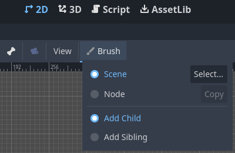

# godot-node-brush-plugin

A plugin for quick placement of 2D nodes in the editor.

Compatible with Godot **4.3 rc 1**.

See [godotengine/godot-proposals#5553](https://github.com/godotengine/godot-proposals/issues/5553).

## How to use

1. Install the plugin and activate it in the Project Settings.
2. Select a node in the Scene dock.
3. The Brush button will appear in the toolbar.
   - Click LMB on it to enable/disable the brush mode.
   - Click RMB on it to edit the brush parameters.
4. As a brush pattern, you can select a scene from the project file system
   or copy the currently selected node from the Scene dock
5. Also, you can choose whether to add the new node as a child or as a sibling
   of the currently selected node.
6. When the brush mode is active, RMB on the workspace adds the scene/node
   at the clicked position.
